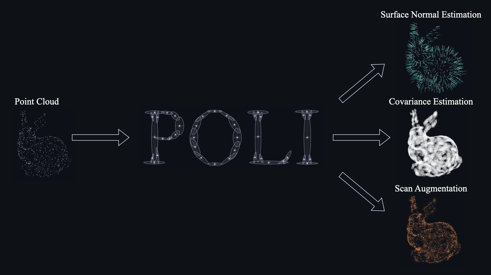
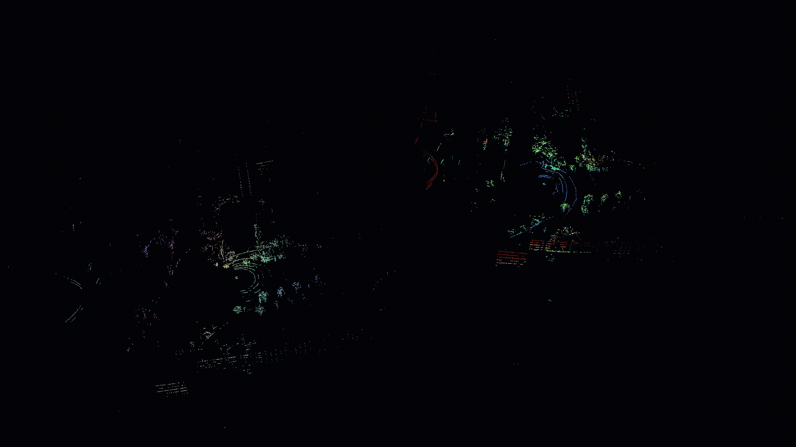
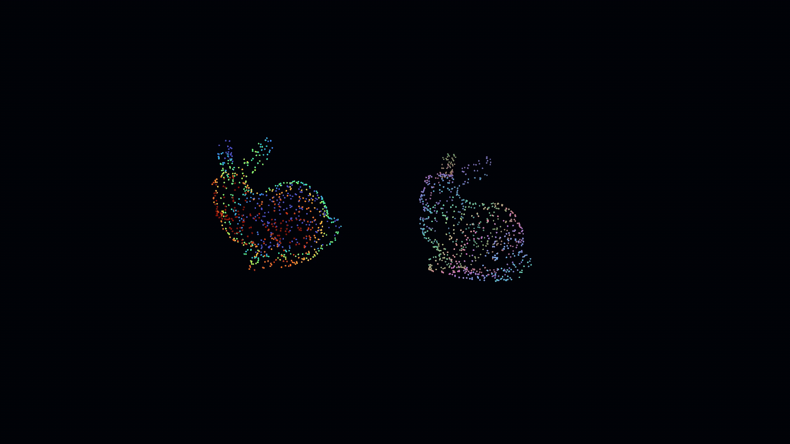
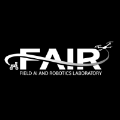

<div align="center">


</div>

---


## About POLI (Point-to-Ellipsoid)

<div align="center">
  <h3><em>Self-supervised geometry reasoning for 3D perception</em></h3>
</div>

<div align="center">
  
</div>

> Point clouds are a fundamental representation for robotic perception tasks such as **localization, mapping, and object pose estimation**. However, LiDAR-acquired point clouds are inherently **sparse and non-uniform**, providing incomplete observations of the underlying geometry. Such sparsity and non-uniformity hinder reliable geometric reasoning, leading to degraded performance in downstream perception tasks. To mitigate these issues, prior work has attempted to compensate for the sparsity and non-uniformity of point clouds by estimating point cloud geometry. However, in the absence of an explicit model of point cloud geometry, existing approaches have predominantly relied on either **hand-crafted statistics** of local point distributions or **end-to-end supervised deep learning**, which often suffer from limited scalability or require large amounts of accurately labeled training data. To address these challenges, we explicitly model and estimate point cloud geometry under a principled mathematical formulation. **Theoretically**, we represent the point cloud geometry as a *statistical manifold* induced by a family of Gaussian distributions that captures the local geometry of each point. Building on this formulation, we design a probabilistic model that predicts per-point local geometry in the form of a Gaussian distribution. **Practically**, we introduce a deep neural network to instantiate the estimation of these Gaussian distributions, and term the resulting estimator as **Point-to-Ellipsoid (POLI)**. By consistently estimating point-wise local geometry across diverse point clouds, POLI learns a mapping between point cloud observations and their underlying geometry. Importantly, this mapping is learned in a **self-supervised manner**, removing the reliance on labeled data while maintaining strong geometric inductive biases. The resulting representation integrates seamlessly into existing robotic perception pipelines **without requiring architectural modifications**. Extensive experiments demonstrate that the proposed theory and practice enable **accurate and robust estimation of point cloud geometry** and consistently improve performance across a wide range of robotic perception tasks.

---

## Getting Started

### Step 1. Clone the Repository

```bash
git clone https://github.com/jinwoolee1230/POLI.git
cd POLI
```

### Step 2. Set Up the Environment

```bash
conda env create -f environment.yml
conda activate poli
```

### Step 3. Install Additional Dependencies

<details open>
<summary><b>For Training</b></summary>

| Package | Repository |
|:--------|:-----------|
| `pointnet2_ops`          | [Pointnet2_PyTorch/pointnet2_ops](https://github.com/erikwijmans/Pointnet2_PyTorch) |
| `sdprlayer / sdprlayers` | [utiasASRL/sdprlayer](https://github.com/utiasASRL/sdprlayer) |
| `torch_kdtree`           | [thomgrand/torch_kdtree](https://github.com/thomgrand/torch_kdtree) |

</details>

<details open>
<summary><b>For Demo and Testing</b></summary>

| Package | Repository |
|:--------|:-----------|
| `pointnet2_ops`        | [Pointnet2_PyTorch/pointnet2_ops](https://github.com/erikwijmans/Pointnet2_PyTorch) |
| `ROBIN / spark_robin`  | [MIT-SPARK/ROBIN](https://github.com/MIT-SPARK/ROBIN) |
| `pyridescence`         | [koide3/iridescence](https://github.com/koide3/iridescence.git) |
| `torch_kdtree`         | [thomgrand/torch_kdtree](https://github.com/thomgrand/torch_kdtree) |

</details>

---

## Pretrained Checkpoints

<div align="center">

| Sensor / Task | Available Checkpoints |
|:-------------:|:----------------------|
| **VLP** (Velodyne) | [`0.2 m`](https://raw.githubusercontent.com/jinwoolee1230/POLI/main/weights/HeLiPR/vlp_helipr_0.2m.pth) &middot; [`0.5 m`](https://raw.githubusercontent.com/jinwoolee1230/POLI/main/weights/HeLiPR/vlp_helipr_0.5m.pth) &middot; [`1.0 m`](https://raw.githubusercontent.com/jinwoolee1230/POLI/main/weights/HeLiPR/vlp_helipr_1.0m.pth) |
| **OS2** (Ouster)   | [`1.0 m`](https://raw.githubusercontent.com/jinwoolee1230/POLI/main/weights/HeLiPR/os2_helipr_1.0m.pth) &middot; [`1.5 m`](https://raw.githubusercontent.com/jinwoolee1230/POLI/main/weights/HeLiPR/os2_helipr_1.5m.pth) &middot; [`2.0 m`](https://raw.githubusercontent.com/jinwoolee1230/POLI/main/weights/HeLiPR/os2_helipr_2.0m.pth) |
| **Object Pose Estimation** | [`object_500n1000points.pth`](https://raw.githubusercontent.com/jinwoolee1230/POLI/main/weights/object/object_500n1000points.pth) |

</div>

---

## Demos

### 1. Global Registration

<div align="center">
  
</div>

**Command**
```bash
python applications/global_registration/POLI_FPFH_ROBIN_GNC.py
```

<details open>
<summary><b>Pipeline &mdash; POLI-Densification + FPFH + ROBIN + GNC-TLS</b></summary>

```python
# 1. Load the pretrained POLI model
model = load_model(checkpoint)

# 2. Predict the underlying geometric structure of each point cloud
P, Q, C_p, C_q = predict_covariances(model, P, Q)

# 3. Densify point clouds by sampling from the learned distributions
P_dense = densify_points(P, C_p, samples_per_point=100, n_std=0.5)
Q_dense = densify_points(Q, C_q, samples_per_point=100, n_std=0.5)

# 4. Compute FPFH features on the densified point clouds
fpfh_p = compute_fpfh(P_dense)
fpfh_q = compute_fpfh(Q_dense)

# 5. Establish mutual feature correspondences
src_idx, tgt_idx = estimate_mutual_feature_matches(fpfh_p, fpfh_q)

# 6. Extract the maximum consensus set
src_inliers, tgt_inliers = maximum_consensus(P_dense[src_idx], Q_dense[tgt_idx])

# 7. Estimate the rigid transformation
R_est, t_est = registration(src_inliers, tgt_inliers)
```

</details>

---

### 2. Object Pose Estimation

<div align="center">
  
</div>

**Command**
```bash
python applications/object_pose_estimation/POLI_FPFH_ROBIN_GNC.py
```

<details open>
<summary><b>Pipeline &mdash; POLI-Normal + FPFH + ROBIN + GNC-TLS</b></summary>

```python
# 1. Load the pretrained POLI model
model = load_model(checkpoint)

# 2. Predict the underlying geometric structure of each point cloud
P, Q, C_p, C_q = predict_covariances(model, P, Q)

# 3. Compute normals from predicted covariances
n_p = extract_normal(C_p)
n_q = extract_normal(C_q)

# 4. Compute FPFH features using the predicted normals
fpfh_p = compute_fpfh(P, n_p)
fpfh_q = compute_fpfh(Q, n_q)

# 5. Establish mutual feature correspondences
src_idx, tgt_idx = estimate_mutual_feature_matches(fpfh_p, fpfh_q)

# 6. Extract the maximum consensus set
src_inliers, tgt_inliers = maximum_consensus(P_dense[src_idx], Q_dense[tgt_idx])

# 7. Estimate the rigid transformation
R_est, t_est = registration(src_inliers, tgt_inliers)
```

</details>

---

### 3. LiDAR Odometry

<div align="center">
  
</div>

**Command**
```bash
python applications/lidar_odometry/POLI_GICP.py \
    --checkpoint    ./weights/HeLiPR/vlp_helipr_0.2m.pth \
    --dataset_dir   [/path/to/train_data] \
    --output_folder ./tmp/poli_gicp
```

<details open>
<summary><b>Pipeline &mdash; POLI-Covariance + Generalized-ICP</b></summary>

```python
# 1. Load the pretrained POLI model
model = load_model(checkpoint)

# 2. Predict the underlying geometric structure of each point cloud
P, Q, C_p, C_q = predict_covariances(model, P, Q)

# 3. Run Generalized-ICP using the learned covariances
R, t = GICP(P, Q, C_p, C_q)
```

</details>

---

## Training

### 1. Download the Dataset

Download the **HeLiPR** dataset from the [official website](https://sites.google.com/view/heliprdataset).

### 2. Generate Training Data

Scene pairs must be generated from each HeLiPR sequence before training.

**Required Inputs**

| Argument | Description |
|:---------|:------------|
| `--lidar_scan`    | Directory containing LiDAR scan files (`.bin`) from a single HeLiPR sequence |
| `--ground_truth`  | Ground-truth trajectory file corresponding to the same sequence |
| `--output_folder` | Output directory where generated training data will be saved |
| `--voxel_size`    | Voxel size in meters |

> **Note:** This preprocessing step should be performed **separately for each HeLiPR sequence**.

```bash
python data_preprocess/scene/HeLiPR_make_dataset.py \
    --lidar_scan     [/path/to/helipr/lidar] \
    --ground_truth   [/path/to/helipr_gt.txt] \
    --output_folder  [/path/to/train_data] \
    --voxel_size     [voxel_size (meter)]
```

### 3. Run Training

**Required Arguments**

| Argument | Description |
|:---------|:------------|
| `--dataset_dir`    | Dataset directory generated in the preprocessing step |
| `--logdir`         | Directory where training logs and checkpoints will be saved |
| `--mean`           | Mean value used for z-score normalization |
| `--scaling_factor` | Standard deviation for z-score normalization (default: `100.0`) |

```bash
python train.py \
    --dataset_dir     [/path/to/train_data] \
    --logdir          [/path/to/logdir] \
    --mean            [MEAN] \
    --scaling_factor  [SCALING_FACTOR]
```
---

## Authors

<table>
  <tr>
    <td align="center">
      <b>Jinwoo Lee*</b><sup>1</sup><br>
      <a href="https://github.com/jinwoolee1230">
        
      </a>
      <a href="https://scholar.google.com/citations?user=NVsHmQ8AAAAJ&hl=ko">
        
      </a>
    </td>
    <td align="center">
      <b>Jiwoo Kim*</b><sup>1</sup><br>
      <a href="https://github.com/Tars0523">
        
      </a>
    </td>
    <td align="center">
      <b>Woojae Shin</b><sup>1</sup><br>
      <a href="https://github.com/sindream">
        
      </a>
      <a href="https://scholar.google.com/citations?hl=ko&user=sMNOzA8AAAAJ">
        
      </a>
    </td>
    <td align="center">
      <b>Giseop Kim</b><sup>2</sup><br>
      <a href="https://github.com/gisbi-kim">
        
      </a>
      <a href="https://scholar.google.com/citations?hl=ko&user=9mKOLX8AAAAJ">
        
      </a>
    </td>
    <td align="center">
      <b>Hyondong Oh</b><sup>1</sup><br>
      <a href="https://scholar.google.com/citations?user=q_Pbm3kAAAAJ&hl=en">
        
      </a>
    </td>
  </tr>
</table>

<h3>
<sup>1</sup> <a href="https://fair.kaist.ac.kr/">Field AI and Robotics Laboratory (FAIR)</a>
<br>
Korea Advanced Institute of Science and Technology (KAIST), Daejeon, Republic of Korea
</h3>

<h3>
<sup>2</sup> <a href="https://sites.google.com/view/aprl-dgist">Autonomy and Perceptual Robotics Lab (APRL)</a>
<br>
Daegu Gyeongbuk Institute of Science and Technology (DGIST), Daegu, Republic of Korea
</h3>

---

## License

This project is released under the **MIT License**. See [LICENSE](./LICENSE) for details.
